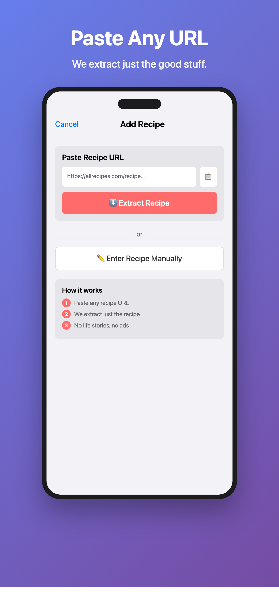
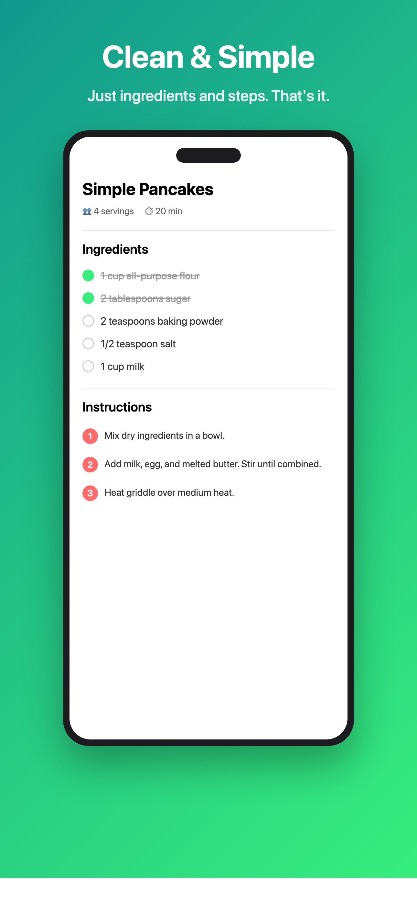

# Just The Recipe 🍳

**Paste any recipe URL. Get just the recipe. No life stories. No ads. No BS.**

## The Problem

Every recipe website buries the actual recipe under:
- 47 ads
- A 2,000-word story about someone's grandmother
- Pop-ups asking for your email
- Auto-playing videos

## The Solution

Just The Recipe extracts ONLY what you need:
- ✅ Ingredients list
- ✅ Step-by-step instructions
- ✅ Cooking times
- ✅ Servings

That's it. No fluff.

## Features

- **Smart Recipe Extraction** — Works with AllRecipes, Bon Appétit, Serious Eats, Food Network, and thousands more
- **Offline Forever** — Recipes save to your device
- **Cook Mode** — Check off ingredients and steps while cooking
- **Manual Entry** — Add your own recipes too
- **Search** — Find recipes instantly
- **Share** — Send clean, formatted recipes to friends
- **Privacy First** — No account, no cloud, no tracking

## Screenshots

  
  
  
  

## Requirements

- iOS 17.0+
- Xcode 15.0+

## Installation

1. Clone this repo
2. Open `JustTheRecipe.xcodeproj` in Xcode
3. Build and run

## Tech Stack

- SwiftUI
- JSON-LD parsing for recipe extraction
- UserDefaults for local storage
- No external dependencies

## License

MIT License - feel free to use, modify, and distribute.

## Author

Built by Yuxuan

---

**100% FREE** — No ads. No subscriptions. No catch.
